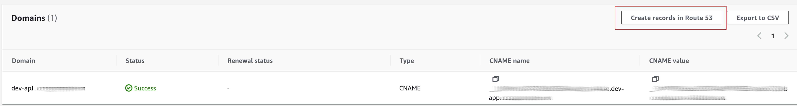
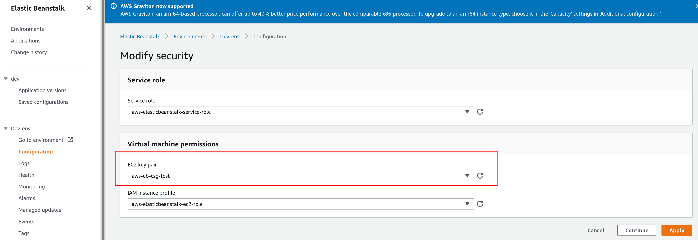

# Deploy Go backend on AWS
> Note: We assume all AWS services are in the same region, to avoid any potential issues. You own a domain name managed by AWS. The backend Go server will be deployed on Elastic BeanStalk with SSL / HTTP and a custom domain name. 

### Install EBS CLI 

To install Elastic beanstalk CLI

```
pip install awsebcli
```

## SSL certificate

We will be serving the golang backend on HTTPS using a custom domain name. We need to create an `SSL` certificate for a custom subdomain using the Amazon Certificate Manager (ACM).

- Request a public certificate


- Use DNS validation to validate that you own the domain name. Enter the fully qualified domain name: `dev-api.cloudgenetics.com` and select `DNS Validation`. 


- Once the SSL certificate has been requested, the subdomain can be validated by creating a CNAME record on Route 53. Use the `create records in Route 53` option to automatically validate the domain and the attached SSL certificate. 




## Go backend on elastic beanstalk

Elastic beanstalk offers a scalable way to deploy web applications. 

> Note: Ensure the ACM certificates and other AWS services are in the same region.

- Instead of using `eb create` to set-up an environment. Go to the welcome page on Elastic Beanstalk (https://console.aws.amazon.com/elasticbeanstalk/home?region=us-east-1#/welcome) and click on get started.


- Create a web app with application name `dev`, choose a Platform `Go` and use `Go 1 on AWS Linux 2` with the recommended platform version. 


- Choose upload go code. Create a zip archive of the golang backend code and upload it:


- Choose `configure more options` and select `High availability` Presets:


- Select `Edit` on `Loand balancer` 


- Choose `Classic Load Balancer` to add both `HTTP` and `HTTPS` listeners. Select "Add listener"


- Set `Listener port` to `443` and `Listener protocol` to `HTTPS`. `Instance port` should be set to `80` and `Instance protocol` to `HTTP`. Select the SSL certificate `dev-api.domainname` created using ACM.  


- You should see two listeners one for HTTP and another for HTTPS.


- Finally the `dev-env` should be ready after several minutes and health status should be `OK`.


- Add the following configuration to `.elasticbeanstalk/config.yml`:

```yml
branch-defaults:
  main:
    environment: dev-env
    group_suffix: null
global:
  application_name: dev
  branch: null
  default_ec2_keyname: aws-eb-csg-test
  default_platform: Go 1 running on 64bit Amazon Linux 2
  default_region: us-east-1
  include_git_submodules: true
  instance_profile: null
  platform_name: null
  platform_version: null
  profile: null
  repository: null
  sc: git
  workspace_type: Application
```

The `env` and `application_name` should match what's created in the Elastic Beanstalk. To update the code, you may use `eb deploy` to deploy a new version of the code on Elastic Beanstalk. 

- Once the required version of code is running healthily on Elastic Beanstalk, we will now configure it to run on a custom domain name with HTTPS. 

## Router 53 custom domain name 

- On the hosted zone, create a new `A-record` with recordname `dev-api` pointing to the alias of the `Elastic Beanstalk` application.


### EC2 Keypair (ssh access on ebs)
Optionally, you may add an EC2 Key-pair to the Elastic Beankstalk application to SSH and check logs. 

- Open EC2 Key-pair option on AWS and select `Create Key pair`.


- Once the keypair is created, go to Elastic Beanstalk environment configuration under `security` and specify the `Key pair`. This may take a few minutes to update the environment. 




- Once updated you can SSH to the Elastic Beanstalk environment using `eb ssh`. Make sure the key is in `.ssh/` folder and `.elasticbeanstalk/config.yml` has the keyname specified to the one created in this step.