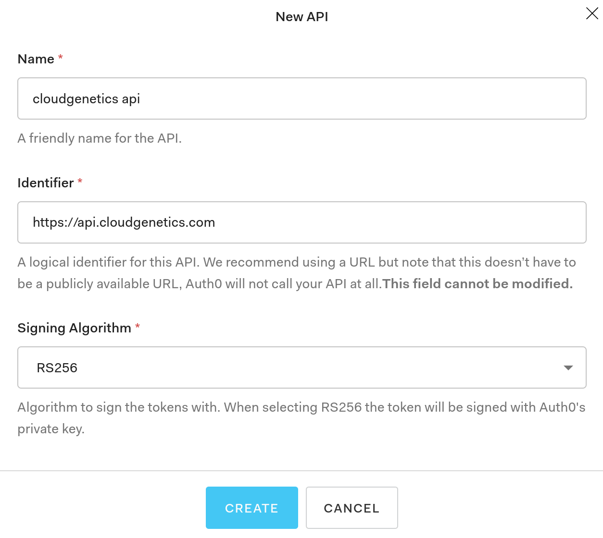

# Backend API
The api server is primarily written in [Go](https://golang.org/) using [Gin Web Framework](https://gin-gonic.com/).

# Prerequisites
  - go
  - gin

## Install prerequisites

It is preferable to run the backend api server on a linux system (Fedora/Ubuntu).

### Install Go

> Fedora installation

```shell
sudo dnf install golang
mkdir -p ~/go/src
echo 'export GOPATH=$HOME/go' >> $HOME/.bashrc
source $HOME/.bashrc
go env GOPATH
```

> Ubuntu installation 

Run the following instruction as `root` or `sudo`
```shell
sudo apt install golang-go gccgo-go
go version
mkdir -p $HOME/go/src
echo 'export GOPATH=$HOME/go' >> $HOME/.bashrc
source $HOME/.bashrc
go env GOPATH
```
  
## Authentication
Authentication for the frontend is provided through [Auth0](https://auth0.com/). Login to Auth0 using your Google/GitHub account.

### Application authentication
[Register API with Auth0](https://auth0.com/docs/get-started/set-up-apis) to integrate the backend api with Auth0.

  1. Go to [`Dashboard > API`](https://manage.auth0.com/#/apis) and click Create API.
  2. Enter a friendly name (cloudgenetics api) and a unique identifier (https://api.cloudgenetics.com) for the API (preferably a URL you have registered). Select RS256 as the signing algorithm.
  
	
### Create users
Once an API has been created, the next step is to add users to the API.
  1. Go to [`Dashboard > Users & Roles > Users`](https://manage.auth0.com/#/users) 
  2. Click create user and enter a valid user email and set a password. Make sure the connection is set to "Username-Password-Authentication".
  
## Get API code and run backend server
  1. Clone the api from github: `mkdir -p $HOME/go/src && cd $HOME/go/src && git clone https://github.com/cloudgenetics/api.git`
  2. Install dependencies: `cd api && go get -d`
  3. Update the `.env` file in the `api` directory: `nano .env` and set `AUTH0_DOMAIN` to Auth0 Domain typically of this form: `username.country.auth0.com` and set `AUTH0_AUDIENCE` to the unique identifier set in the previous section: `https://api.cloudgenetics.com`.
  4. Compile the code: `go build -o api` and run the API server `export GIN_MODE=release && ./api`
  5. Yay! The api server is now running!
  
Please report any issues on [GitHub cloudgenetics api](https://github.com/cloudgenetics/api/issues)


