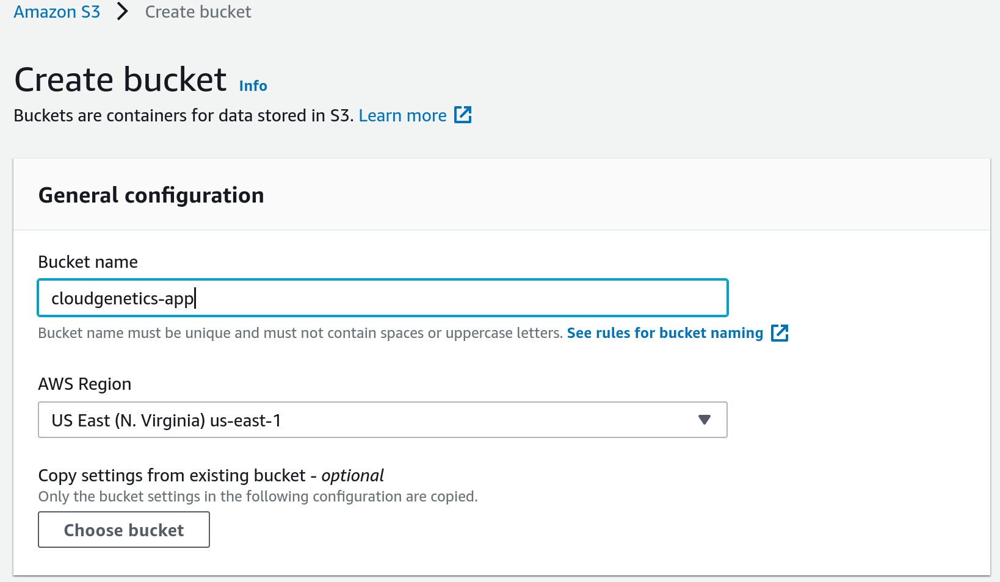
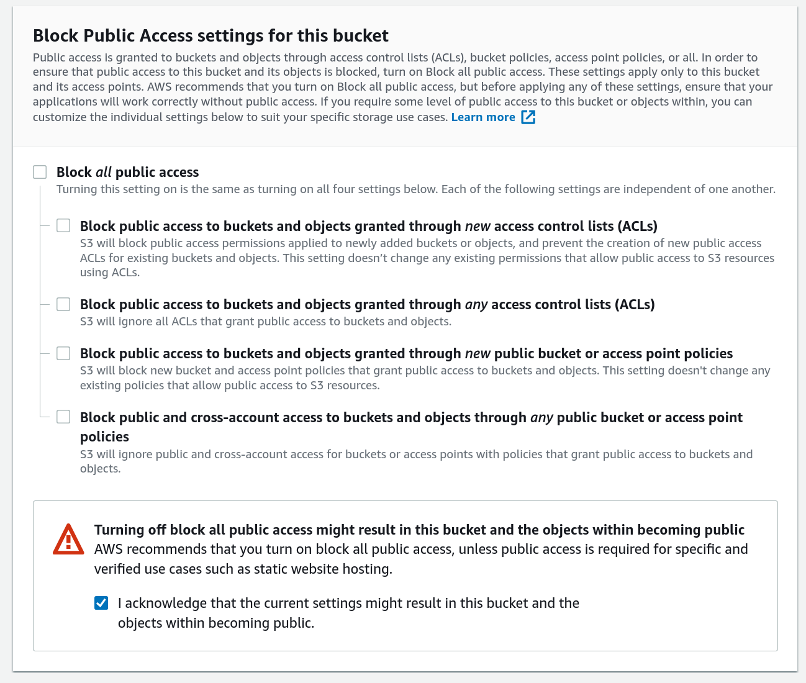
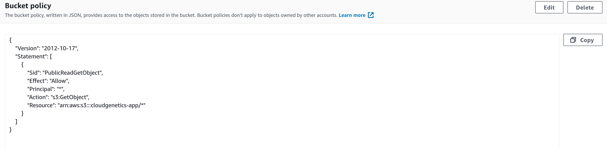
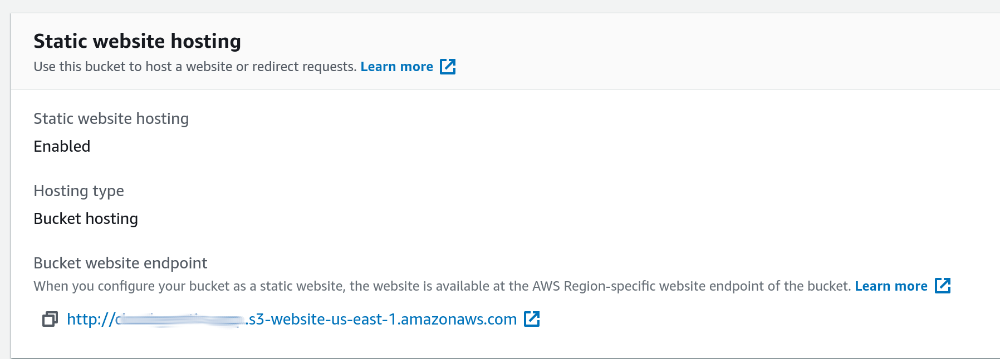

# Deploy Frontend to AWS

> Note: All AWS services must be in the same region to avoid any issue
## Upload files to S3

- Create an S3 bucket `cloudgenetics-app`. 



- Uncheck `Block all public access` for public access and acknowledge. 



- In the permissions tab: `https://s3.console.aws.amazon.com/s3/buckets/<bucketname>?region=us-east-1&tab=permissions` edit the `Bucket Policy`

```json
{
    "Version": "2012-10-17",
    "Statement": [
        {
            "Sid": "PublicReadGetObject",
            "Effect": "Allow",
            "Principal": "*",
            "Action": "s3:GetObject",
            "Resource": "arn:aws:s3:::<bucketname>/*"
        }
    ]
}
```



- In the S3 bucket properties tab `https://s3.console.aws.amazon.com/s3/buckets/<bucketname>?region=us-east-1&tab=properties` enable `static website`.



- Edit the `scripts` section in `package.json` and add the following line to deploy the `dist` folder after build to `aws`:

```json
  "scripts": {
    "serve": "vue-cli-service serve",
    "build": "vue-cli-service build",
    "deploy": "aws s3 sync dist/ s3://cloudgenetics-app/"
  }
```

- Deploy to AWS S3 using `yarn build` and `yarn deploy`

```shell
yarn build && yarn deploy
```