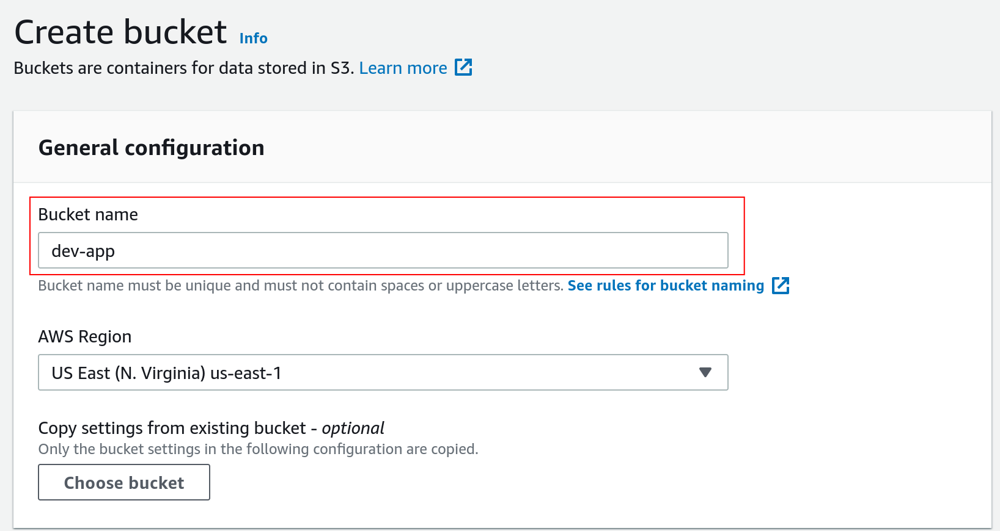
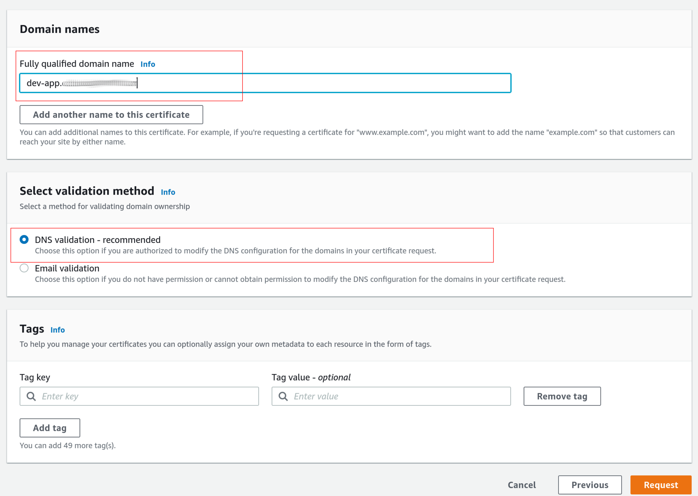
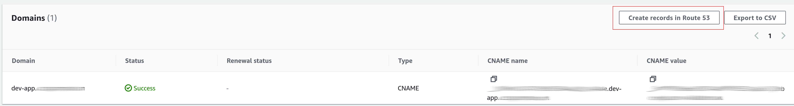
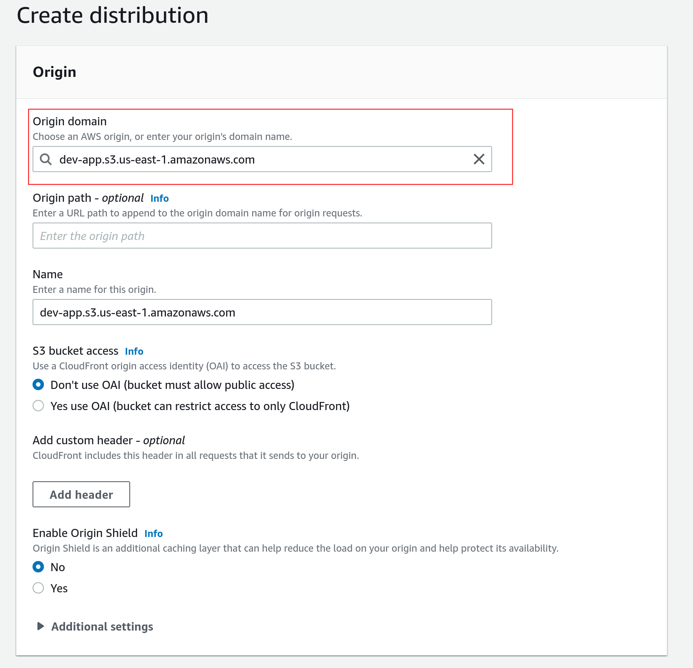

# Deploy Frontend to AWS

> Note: All AWS services must be in the same region to avoid any issues. We assume that you have a domain name registered and managed by AWS.

## Upload files to S3
We will serve the static VUE Frontend files from S3.

- Create an S3 bucket `dev-app`. 



- Uncheck `Block all public access` for public access and acknowledge. 


- In the permissions tab: `https://s3.console.aws.amazon.com/s3/buckets/<bucketname>?region=us-east-1&tab=permissions` edit the `Bucket Policy`

```json
{
    "Version": "2012-10-17",
    "Statement": [
        {
            "Sid": "PublicReadGetObject",
            "Effect": "Allow",
            "Principal": "*",
            "Action": "s3:GetObject",
            "Resource": "arn:aws:s3:::<bucketname>/*"
        }
    ]
}
```


- In the S3 bucket properties tab `https://s3.console.aws.amazon.com/s3/buckets/<bucketname>?region=us-east-1&tab=properties` enable `static website`. Note down the static S3 url: `http://dev-app.s3-website-us-east-1.amazonaws.com`.


- Edit the `scripts` section in `package.json` and add the following line to deploy the `dist` folder after build to `aws`:

```json
  "scripts": {
    "serve": "vue-cli-service serve",
    "build": "vue-cli-service build",
    "deploy": "aws s3 sync dist/ s3://dev-app/"
  }
```

- Deploy to AWS S3 using `yarn build` and `yarn deploy`

```shell
yarn build && yarn deploy
```

- This serves the VUE frontend app on `HTTP` on S3. For authentication to work, we need `HTTPS` through AWS Cloudfront. 

## Amazon Certificate Manager (ACM)

To serve from `HTTPS`, we need to request an `SSL` certificate from `ACM`.

- Request a public certificate


- Use DNS validation to validate that you own the domain name. Enter the fully qualified domain name: `dev-app.cloudgenetics.com` and select `DNS Validation`. 



- Once the SSL certificate has been requested, the subdomain can be validated by creating a CNAME record on Route 53. Use the `create records in Route 53` option to automatically validate the domain and the attached SSL certificate. 



> Note: Leave the CNAME record created to autorenew SSL certificates. Creation and propagation of the SSL certificate may take a few minutes. 

## AWS Cloudfront to serve s3 files on HTTPS

We will create a distribution on AWS cloudfront to serve the static S3 files over HTTPS.

- Create a distribution in the same region (here we use `us-east-1`). Specifiy the `Origin domain` as the S3 bucket `dev-app.s3.us-east-1.amazonaws.com`. 



- Set redirect `HTTP` to `HTTPS`:


- Specify the `CNAME` alternate domain name configured in Route 53.
- Specify the `SSL` certificate create in ACM.
- Enter `index.html` as the root object.


