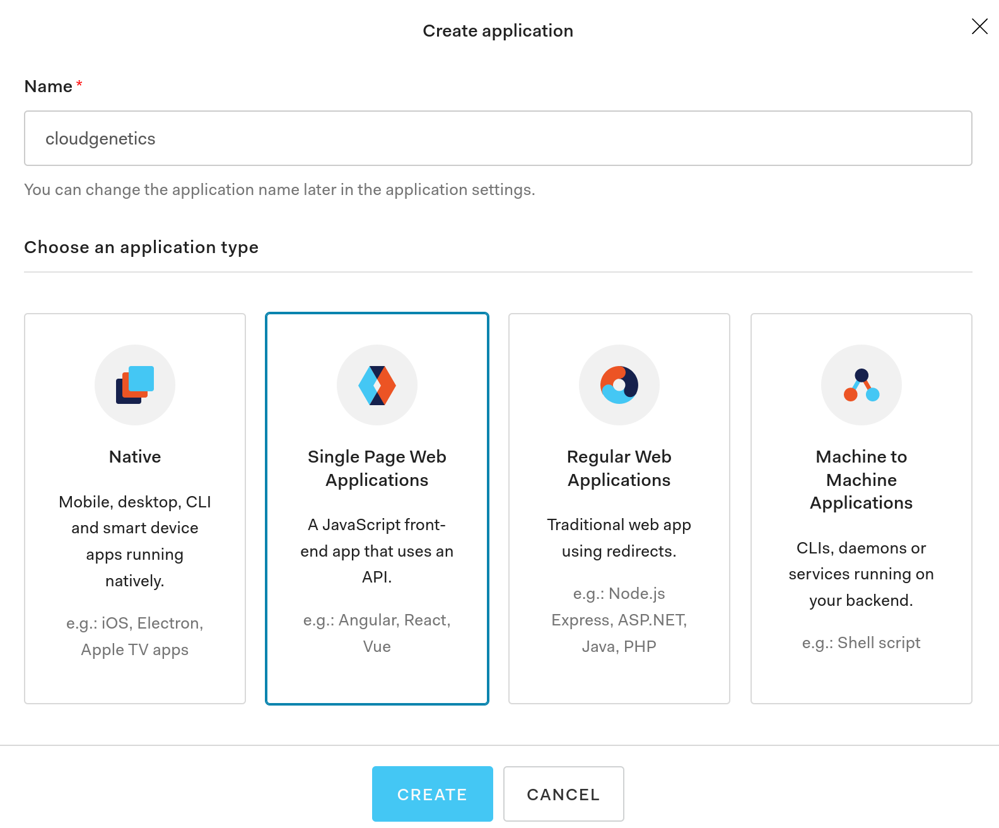
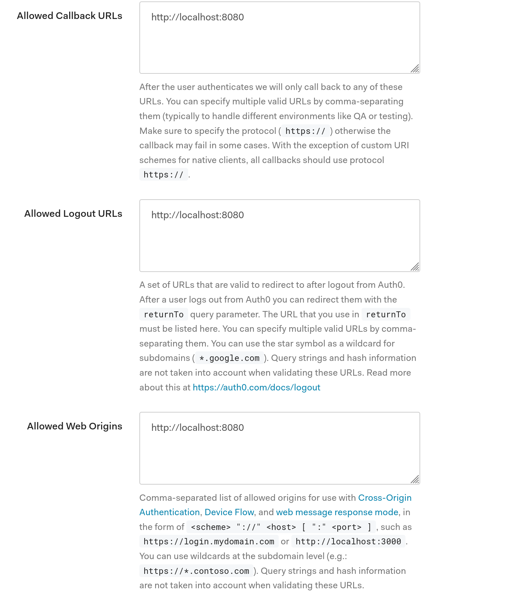
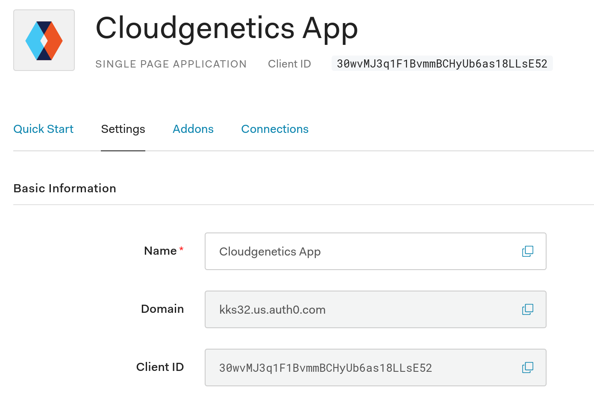

# Frontend
The webapp is primarily written in [Vue](https://vuejs.org/) using [Vuetify](https://vuetifyjs.com/en/) material UI library.

# Prerequisites
  - npm
  - yarn
  - Vue 2

## Install prerequisites

It is preferable to run the webapp on a linux system (Fedora/Ubuntu).

### Install node and npm
> Fedora installation

```shell
 sudo dnf install nodejs
```

> Ubuntu installation 

```shell
curl -sL https://deb.nodesource.com/setup_12.x | sudo -E bash -
sudo apt install nodejs
node --version
npm --version
```

### Install yarn and vue

```shell
npm install --global yarn
yarn global add @vue/cli
```

## Authentication
Authentication for the frontend is provided through [Auth0](https://auth0.com/). Login to Auth0 using your Google/GitHub account. 

### Application authentication
[Register App as a Single-page webapp with Auth0](https://auth0.com/docs/applications/set-up-an-application/register-single-page-app) to integrate the web app with Auth0.

  1. Go to [`Dashboard > Applications`](https://manage.auth0.com/#/applications) and click Create Application.

  2. Enter a descriptive name for your application ("cloudgenetics"), select Single-Page Web Applications, and click Create. 
  
  
  
  3. Under the "settings" tab set the "Allowed Callback URLs", "Allowed Logout URLs", and "Allowed Web Origins" as your server url for the web app ("http://localhost:8080"). After setting the fields, click "Save" to record the settings.
  
  4. Under the "Settings" tab, record the `Domain` and `Client Id`. This is needed for configuring the webapp.
  
  5. Navigate to "Connections" tab and ensure the Social option of google-oauth2 is disabled. 
  
## Get code and run webapp
  1. Clone the webapp from github: `cd $HOME && git clone https://github.com/cloudgenetics/webapp.git`
  2. Install dependencies: `cd webapp && yarn install`
  3. Update the file `auth_config.json` with the domain and clientid from step #4 in the previous section. Set `audience` as `https://localhost:4000` this is the ServerURL from where the backend service will be run:
  ```json
  {
    "domain": "kks32.us.auth0.com",
    "clientId": "5DtiTEV0juj2VxGMVsyzERHbJ4TTNuMl",
    "audience": "https://localhost:4000"
  }
  ```
  4. Compile code and serve: `yarn serve`. This should start serving the cloudgenetics webapp on `http://localhost:8080`. Ensure this port and your auth0 configuration of callback URLs match.
  5. Yay! The webapp is now running!
  
Please report any issues on [GitHub cloudgenetics webapp](https://github.com/cloudgenetics/webapp/issues)
